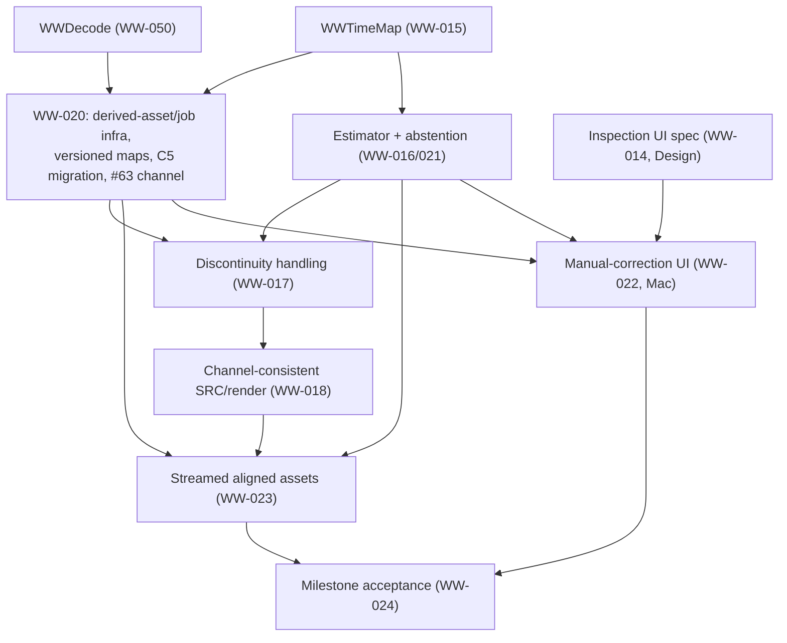

# WW-019: M2 scope, contracts and engineering authorization record

Stable ID: [WW-019 (#16)](https://github.com/brandonmartinez/WaveWrangler/issues/16). Owner: Lead.
Milestone: [M2 — Recording alignment](https://github.com/brandonmartinez/WaveWrangler/milestone/2).

This document **records** the M2 scope, contracts, evidence, risks and authorization already granted
by the user in [`docs/planning/kickoffs/m2.md`](../planning/kickoffs/m2.md) (pasted 2026-10-06). It is
not a second generic approval, and it does not itself close out WW-024 (milestone acceptance). Where a
number or scope item is drawn verbatim from the kickoff, this record cites the kickoff rather than
paraphrasing it loosely.

**Issue #16 acceptance-criteria status (not yet met in full):** "M1 accepted; WW-014–WW-018 and WW-050
... evidence accepted for exact envelope" is **not yet true** — WW-016's candidate gate FAILED (§6) and
WW-018 is PENDING (§5). This record satisfies the issue's "record selected contracts, exact permitted
content scope and prerequisite acceptance here, without requesting another generic approval" clause; the
outcome-acceptance clause remains open until WW-014–018/050 land and are independently evidenced, and is
tracked at milestone exit by WW-024 (#20), not here.

## 1. Scope

### 1.1 In scope (M2)

| # | Item |
| --- | --- |
| 1 | Read-only content gateway + native decoder for the claimed macOS import envelope (WW-050). |
| 2 | Clock-epoch/coordinate time-map contract with a supported inverse (WW-015). |
| 3 | Calibrated affine offset/drift estimator with honest abstention (WW-016/021). |
| 4 | Discontinuity handling: explicit flag/unsupported policy, never silent smoothing (WW-017). |
| 5 | Versioned map/derived-asset/job infrastructure, C5 schema migration, explicit stated channel (#63) (WW-020). |
| 6 | Qualified channel-consistent sample-rate correction/render candidate (WW-018). |
| 7 | Streamed, channel-consistent aligned derived assets with immutable originals (WW-023). |
| 8 | Native inspection and manual-correction workspace (WW-014 spec, WW-022 implementation). |

### 1.2 Out of scope (M2)

| # | Item |
| --- | --- |
| 1 | **Audio handoff.** M2 produces internal derived assets (time-aligned, channel-consistent) for inspection/correction only — not an editable/exportable cut. First audio handoff remains cleaned-track M4. |
| 2 | Transcription or speech analysis of any kind (M3). |
| 3 | Public-release/participant qualification, Increase Contrast, Reduce Motion, 200% text opt-in (M5 / WW-053 per the M1 exit decisions). |
| 4 | Any recording, model, or native asset acquisition beyond the single consented episode copy and synthetic fixtures (§7). |
| 5 | Cross-device/provider conflict claims beyond the synthetic iCloud scope (§7); live two-Mac iCloud tests stay disabled per #146. |
| 6 | Guaranteed support for any candidate format/codec beyond the exact evidenced envelope (WW-050). |

Aligned/channel-consistent assets produced in M2 are **internal derived assets** used for inspection and
correction, not a deliverable audio product.

## 2. Module plan and ownership

| Module / unit | WW ID(s) | Owner | Status at authoring | Notes |
| --- | --- | --- | --- | --- |
| `WWDecode` | WW-050 (#45) | Mac | In progress (Mac lane) | Read-only content gateway + native decoder; evidence-driven envelope only, no unsupported-format claim. |
| `WWTimeMap` | WW-015 (#10) | Alignment | In progress (Alignment lane) | Clock-epoch/coordinate contract; supported inverse ≤0.5 source frame. |
| WW-020 infra (derived-asset/job infra, versioned map persistence, C5 migration, #63 channel) | WW-020 (#19) | Mac | Planned | Builds on `WWDecode`/`WWTimeMap`; adds the explicit stated-channel value replacing the v1 index-0 placeholder. |
| Estimator with abstention | WW-016 (#15) / WW-021 (#24) | Alignment | Planned (WW-016 candidate FAILED; see §6) | Must clear the WW-016 holdout gate (§5) before WW-021 production use. |
| Discontinuity handling | WW-017 (#11) | Alignment | Planned | Depends on WW-015/016 residual behavior. |
| Channel-consistent SRC/render + streamed assets | WW-018 (#13) / WW-023 (#18) | Alignment | Planned (WW-018 PENDING) | 64-tap Blackman sinc is a *candidate*, not a qualified production SRC (§6). |
| Inspection & manual-correction UI | WW-014 (#14) spec / WW-022 (#17) impl | Design (spec) / Mac (impl) | Spec PARTIAL, impl PENDING | Anchor list, time editors, audition, source-vs-aligned labels, keyboard/VoiceOver. |
| Milestone acceptance | WW-024 (#20 in M2 issue numbering, milestone-exit unit) | Lead | PENDING | Gated on all of the above; not opened by this record. |

### 2.1 Dependency graph

Per `docs/planning/backlog.md`, WW-020's declared dependency list also names WW-017 (so its persisted map
schema must reserve fields for discontinuity/gap semantics even though full discontinuity *detection*
lands after WW-020's first cut) — this is the one place the backlog's formal dependency edges and the
kickoff's narrative build order diverge; both are satisfied by landing WW-020's schema with gap/restart
fields present but inert until WW-017 populates them.

### 2.2 Safe-parallel order

1. **Now, in parallel:** `WWDecode` (WW-050, Mac) and `WWTimeMap` (WW-015, Alignment) — disjoint folders,
   no shared mutable state; WW-014's spec (Design) can also proceed in parallel, it only depends on M1
   work.
2. **Next:** WW-020 (Mac) once `WWDecode` + `WWTimeMap` land; WW-016/021 estimator (Alignment) once
   `WWTimeMap` lands — these two can run in parallel (disjoint: persistence/job infra vs. alignment math).
3. **Next:** WW-017 discontinuity handling (Alignment), after WW-016/021.
4. **Next:** WW-018 render qualification (Alignment), after WW-017; WW-022 manual-correction UI (Mac),
   after WW-020 + WW-014 spec — these two can run in parallel (disjoint: DSP vs. UI).
5. **Last:** WW-023 streamed assets (Alignment, after WW-018 + WW-020 + WW-021), then WW-024 milestone
   acceptance (Lead).

## 3. Contracts M2 adds or extends

Numbered following the [WW-009 (#9)](https://github.com/brandonmartinez/WaveWrangler/issues/9) M1
contracts pattern (`docs/m1/ww-009-m1-contracts.md`, C1–C10); M2 contracts are `M2-C1`...`M2-C7`.

| ID | Name | Contract |
| --- | --- | --- |
| M2-C1 | Content gateway & forbidden-API scope | All source-content reads go through `WWSources`' read-only `SourceIO` gateway (`WWDecode` extends this; it never uses `FileHandle`, `moveItem`, `write(to:)` or other mutating/content APIs directly — enforced by `ForbiddenAPITests`). Decode is evidence-driven: only the exact evidenced input envelope is claimed supported; no broader codec/format guarantee. |
| M2-C2 | Decode descriptor + `formatInterpretationVersion` | Every decode result carries a descriptor (source reference, container/codec, sample rate, bit depth, channel count, priming/padding frame counts) plus a `formatInterpretationVersion`. A version bump invalidates every derived job keyed to the prior version (see M2-C5); descriptors are never silently reinterpreted in place. |
| M2-C3 | Time-map conventions | `source_frame / F + epoch = group` (shared clock coordinate); `aligned = a × group + b`; `map_ppm = 10⁶ × (a − 1)`. Lag sign: a target later by positive lag needs `b = −lag / F`. Supported inverse ≤0.5 source frame (shared gate with WW-050, §5). Known restart gaps are **non-invertible** — no smoothing/interpolation across them; a gap always starts a new epoch. Capture/container metadata (e.g. stream timestamps) is **never** treated as clock proof; it is supplied input, not a discovered or verified fact. |
| M2-C4 | Map states | Every persisted map carries one of: `clockApproved` (passed the frozen holdout gate, §5), `acousticConsistentProposal` (passed calibration but not yet an approved clock correction — acoustic delay must never be presented as a clock correction), `manual` (user-entered/corrected), or `externalEvidence` (segment metadata supplied by the user/pipeline, not discovered). Scores attached to proposals are **not probabilities** and must never be labelled or rendered as such. |
| M2-C5 | Invalidation keys & no-stale-late-publish | Derived jobs (maps, aligned assets) are keyed on: source revision, format revision (`formatInterpretationVersion`), asset revision, epoch, occurrence, channel, map revision, recipe revision, and upstream (dependency) revisions. Any key change invalidates the derived result. A job whose key is stale by the time it completes **must not publish**; this extends M1's WW-009 C3 (publication ordering) to M2's job/derived-asset pipeline — M2 derived data publishes through the same ordering contract, not a parallel one. |
| M2-C6 | C5 migration: explicit stated channel (#63) | Show-schema migration follows WW-009 C5 (unknown-newer refusal: an older build refuses a file whose schema is newer than it understands; non-overwriting backup before migrating). The v1 schema's index-0 "Unknown channel" placeholder is replaced by an explicit stated-channel value (`Knowledge<Int>`-shaped: Unknown until the user states it, never encoded as index 0). Migration keeps any user-stated `placement.channelLabels` and converts bare index-0 placeholders to Unknown. Tests cover a v1 file with and without stated channels. |
| M2-C7 | Main-thread budget & essential accessibility | Decode and alignment work stay off the main thread (NSDocument I/O remains main-thread by design, unchanged from M1). Episode-switch budget: p95 95 ms measured vs. a <100 ms gate (narrow headroom — any new per-switch work on the inspection/correction UI must be profiled against this budget). Every UI PR touching M2 surfaces satisfies the essential-accessibility invariant (§8) for its changed surfaces, not milestone-deferred. |

## 4. Fixture-registry / freeze plan (no fixtures frozen yet)

M2 fixture generators do not exist yet, so **nothing is frozen in this record** — this section documents
the *plan*, following the M1 pattern in `docs/m1/ww-003-fixture-protocol.md` (§3–4): calibration may only
tune non-gate parameters; a frozen revision is a dated, committed record (fixture ID, recipe, truth,
split/counts, gate, generator-tree commit SHA) made **before** the first holdout case is run; holdout then
runs once per frozen revision on a clean commit, with every case reported (never a partial/cherry-picked
subset); percentiles are nearest-rank (p95 = value at rank `⌈0.95 × n⌉`), and max is always reported
alongside p95.

Planned M2 freeze points (one freeze record per gate, before that gate's first holdout):

| Planned freeze | Covers | Gate(s) it freezes against |
| --- | --- | --- |
| m2-freeze-decode | WW-050 decode truth cases (priming/padding/decoded-frame origin, variable-rate, bit depth/channel metadata, corrupt/truncated/unsupported cases) | WW-050 landmark ≤1 output frame; 100% supported-truth mapping; explicit error/no-mutation on bad input. |
| m2-freeze-timemap | WW-015 clock/epoch/coordinate round-trip cases | WW-015 round-trip ≤0.5 source frame; gap non-invertibility. |
| m2-freeze-estimator | WW-016 positive + negative (acoustic-delay, disconnected, ambiguous) windows | WW-016 held-out residual p95 ≤5 ms / max ≤10 ms; ≥5 windows spanning ≥80% overlap; ≥60% eligible; zero false accepts. |
| m2-freeze-discontinuity | WW-017 planted-discontinuity fixtures | Zero silent smooth bridging; all planted discontinuities flagged/unsupported. |
| m2-freeze-render | WW-018 SRC/render fixtures (landmarks, passband/alias, interchannel skew/phase, inactive-channel level) | WW-018 objective gates (§5); phase tolerances are fixture-specific and must be calibrated/frozen before holdout — no invented universal phase bound. |

Counts may only increase before a freeze; they never decrease after a freeze without an explicit, dated
user decision (mirroring WW-003 §4).

## 5. Gates

Gate numbers below are reproduced verbatim from the kickoff/backlog; the "Kind" column states whether the
number is a **calibration** target (tuned pre-freeze) or a **frozen-holdout** gate (checked once per frozen
revision per §4).

| WW unit | Gate | Kind |
| --- | --- | --- |
| WW-016 | Held-out residual p95 ≤ 5 ms, max ≤ 10 ms | Frozen-holdout |
| WW-016 | ≥5 windows spanning ≥80% of declared overlap | Frozen-holdout |
| WW-016 | ≥60% eligible windows | Frozen-holdout |
| WW-016 | Zero false accepts on the finite negative set | Frozen-holdout |
| WW-015 / WW-050 | Supported round-trip (inverse) ≤0.5 source frame | Frozen-holdout |
| WW-050 | Landmarks ≤1 output frame | Frozen-holdout |
| WW-050 | 100% of supported truth cases map priming/padding/decoded-frame origin, variable rate, bit depth/channel correctly | Frozen-holdout |
| WW-018 | Documented ratio `a·Fout/Fin`; clock pitch `1/a` kept distinct from a separate time-stretch | Calibration (definitional) |
| WW-018 | Landmarks ≤1 output frame after delay | Frozen-holdout |
| WW-018 | Passband ±0.1 dB through 80% of lower Nyquist | Frozen-holdout |
| WW-018 | Alias ≤ −80 dBc (provisional) | Frozen-holdout |
| WW-018 | Interchannel skew ≤1 output frame vs. known relative truth; 0 inversions/swaps | Frozen-holdout |
| WW-018 | Inactive-output peak ≤ −80 dBFS on an isolated-channel −1 dBFS fixture | Frozen-holdout |
| WW-018 | Interchannel tone phase-error metric and tolerances | Calibration, frozen before holdout (fixture-specific, no universal bound) |
| WW-018 | Spectral/channel/listening rubric and counts | Calibration, frozen before holdout |
| WW-018 | ≥3 consented listeners, objectionable-artifact ratings | Frozen-holdout — **NOT granted; blocked, not passed** (§6) |
| WW-018 | Family peak ≤1 GiB | Frozen-holdout |
| WW-018 | License/notices resolved | Gate (non-numeric) |

## 6. Retained evidence and risks (carried forward, not re-litigated)

| Item | Status | Evidence |
| --- | --- | --- |
| WW-016 candidate gate | **FAILED** | 4/4 positive windows met targets (worst max error 0.007505 ms), but 2/6 acoustic negatives were falsely accepted: a constant ~35 ms delay produced a ~35.0 ms max clock-error estimate, and a variable delay produced a ~44.2 ms max clock-error estimate *with stronger confidence than the true positives*. Discontinuity/unrelated/silent/periodic negatives correctly abstained (4/4). See `docs/research/waveform-clock-render-readiness.md`. |
| SRC/render candidate | Not qualified | The 64-tap Blackman-windowed-sinc renderer is a **candidate**, not a qualified production SRC; WW-018's objective gates (§5) are not yet cleared against it. |
| Decode envelope | Narrow, evidenced only | Exercised decode is 6-channel, 16-bit PCM WAV at 12/16 kHz only; render inputs exercised at 16 kHz only. No compressed-codec, BWF, broader-codec, or 12→48 kHz render claim exists yet. |
| Foundation sparse maps | Synthetic/finite | Foundation-spike maps (`docs/research/foundation-spikes.md`) are synthetic and finite; they inform the timing-contract formulas (§3, M2-C3) but carry no production-scale coverage claim. |
| WW-018 listening | **Blocked, never passed** | ≥3 consented listeners for the objectionable-artifact rating has **not** been granted; this must be reported as blocked, not as passed, until granted with exact scope. |
| M1 host limits | Unchanged | Claimed host is macOS 27.0.1 / Xcode 27 / 18-core / 128 GiB only — not macOS 26 / 16 GiB. CI runs GitHub-hosted macOS 26, Xcode 26.6 / SDK 26.5, no GUI tests. |
| Runtime constraint | Unchanged | #101: Swift 6.3 runtime constraint applies; ad-hoc signing continues. |
| Native OFF/nil risk | Mitigated, not dismissed | Carried from M1 §9; still applies wherever `WWDecode` exposes a native-vs-fallback seam. |
| Merged-fade footprint | Unexecuted, deferred | Tracked for M3/M4 (WW-028/036/043); not evaluated in M2. |
| Tokenizer network fallback | Deferred, fail-closed required | `download:false` must fail closed in M3 (WW-026); noted here only because WW-020's job infrastructure must not reintroduce an equivalent silent-fallback shape. |
| REF-019 "primary change marks dependents stale" | Not yet evidenced | WW-020/WW-022 must demonstrate this invalidation behavior (ties to M2-C5). |
| Episode-switch budget | Narrow headroom | p95 measured 95 ms vs. a <100 ms gate; any new per-switch work must be profiled against this before landing. |
| Two-device iCloud recovery/sync | Deferred | No cross-device recovery/sync claim; FAILED both M1 runs (95/100, 99/100); tracked as #146, out of scope for M2 (§1.2). |

## 7. Content consent scope and date

Per the kickoff (`docs/planning/kickoffs/m2.md`, pasted 2026-10-06). This record never writes any path or
file name of user media.

**Approved:**
- The user-provided disposable local episode copy (path withheld), local only, read-only, for M2
  import/decode/time-map/group-alignment/manual-correction/channel-consistent-asset validation. The same
  copy is available at the same location on the Mac mini under the same consent.
- No cloud/provider upload, no external service, no transcription or speech analysis (that is M3 scope).
- Automated tests/CI: synthetic fixtures only — never the consented episode copy.
- Standing GUI consent on the Mac mini for all ongoing/future UI, VoiceOver and accessibility work
  (ad-hoc app runs, XCUITest/accessibility audits, computer-use interaction); any temporary VoiceOver or
  display-setting change is restored after use.
- Synthetic iCloud scope: one dedicated trial folder (an M1-named or M2-sibling synthetic trial folder),
  generated synthetic files only, deleted after each run with the deletion recorded. Multi-device
  deliberate-conflict testing is allowed in that scope, but M2 makes no claim that needs it (live
  two-Mac iCloud tests stay disabled per #146, §6).

**Not authorized for M2 unless separately granted with exact scope:**
- Model-body or native-asset provisioning.
- Any recording or optional sample folder beyond the one consented episode copy.
- Provider/cloud/network trials beyond the synthetic iCloud scope above, including multi-device trials.
- Consented listeners for the WW-018 listening gate (§5, §6 — currently blocked, not granted).
- OneDrive/Dropbox or any other external storage provider.
- Full Keyboard Access toggle, system colour filters, or network disconnection.
- Signing credentials.
- External publishing.

## 8. UI regression policy, essential accessibility, exit checkpoint, M2 exit gate

These are summarized rules; the kickoff (`docs/planning/kickoffs/m2.md`) and the M1 exit decisions log
(`docs/planning/milestone-exits/m1.md` §8) are authoritative — this section is a pointer, not a restatement
with new wording.

- **UI regression policy:** every UI PR touching an M2 surface re-runs the essential-accessibility checks
  (below) for its changed surfaces only; essential accessibility is an invariant in every milestone, not a
  milestone-exit-only check.
- **Essential accessibility invariant (every UI PR):** a keyboard-only path with visible focus and
  Return/Esc; AX role/label/value via the `elementDetection`, `sufficientElementDescription`, `hitRegion`
  and `action` audit types (`.contrast` only on blocked/recovery surfaces); every blocked/error/recovery
  state reachable, labelled and legible; no colour-only state and no drag-only interaction.
- **Exit checkpoint:** one slot of at most 30 minutes at milestone exit, covering in-app 200% text plus
  light/dark on the milestone's windows; system Increase Contrast is not part of it (moved to M5). Only a
  finding that makes a core task impossible blocks; the rest become WW-053 follow-ups.
- **M2 exit gate:** gated on WW-024 (#20) milestone acceptance — automated supported cases and
  manual/disconnected/restart cases remain honest; accepted maps/render channels meet their approved
  held-out/listening gates (§5); source/group/aligned provenance, immutable sources and accessible
  corrections are complete. This record does not itself satisfy WW-024.

## Proposed decisions (for coordinator review; not written to `.squad/decisions.md` by this PR)

1. Record WW-019 as a **documentary acceptance-criteria record**, not an outcome acceptance: issue #16's
   "WW-014–018/050 evidence accepted" clause is not yet true (WW-016 FAILED, WW-018 PENDING), so this PR
   does not propose `Closes #16`; #16 stays open until that evidence lands and WW-024 accepts the
   milestone.
2. Adopt M2-C1..M2-C7 (§3) as the canonical M2 contract numbering, extending WW-009's C1–C10 pattern.
3. Adopt the fixture-registry freeze-point names in §4 (`m2-freeze-decode`, `m2-freeze-timemap`,
   `m2-freeze-estimator`, `m2-freeze-discontinuity`, `m2-freeze-render`) as the naming convention lanes
   should use when they commit each freeze record, mirroring M1's `m1-freeze-N` convention.
